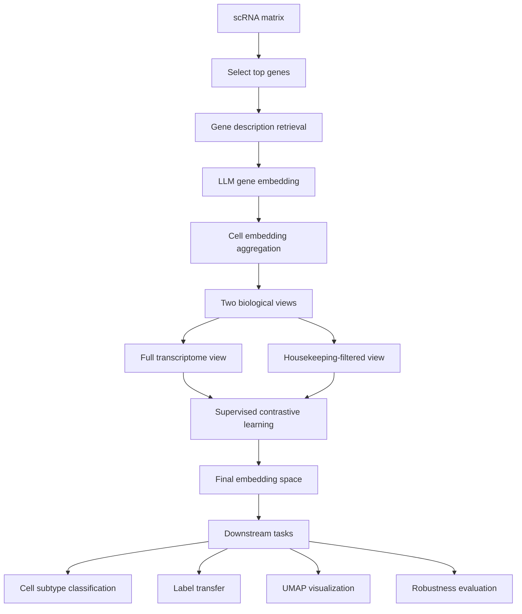

# NV-Rep Pipeline (Mermaid)

```mermaid
flowchart TD
    A["scRNA matrix"] --> B["Select top genes"]
    B --> C["Gene description retrieval"]
    C --> D["LLM gene embedding"]
    D --> E["Cell embedding aggregation"]
    E --> F["Two biological views"]
    F --> F1["Full transcriptome view"]
    F --> F2["Housekeeping-filtered view"]
    F1 --> G["Supervised contrastive learning"]
    F2 --> G
    G --> H["Final embedding space"]
    H --> I["Downstream tasks"]
    I --> I1["Cell subtype classification"]
    I --> I2["Label transfer"]
    I --> I3["UMAP visualization"]
    I --> I4["Robustness evaluation"]
```
